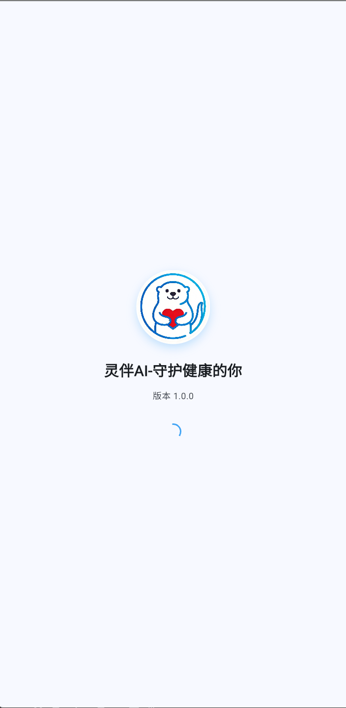
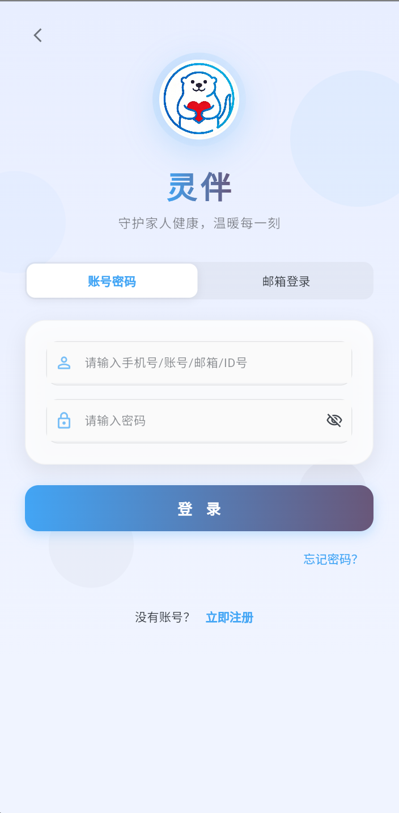
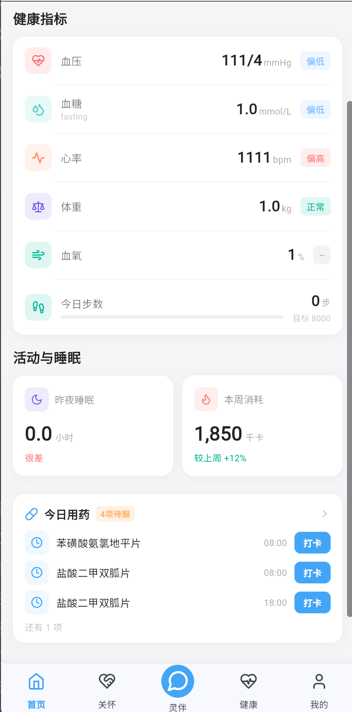
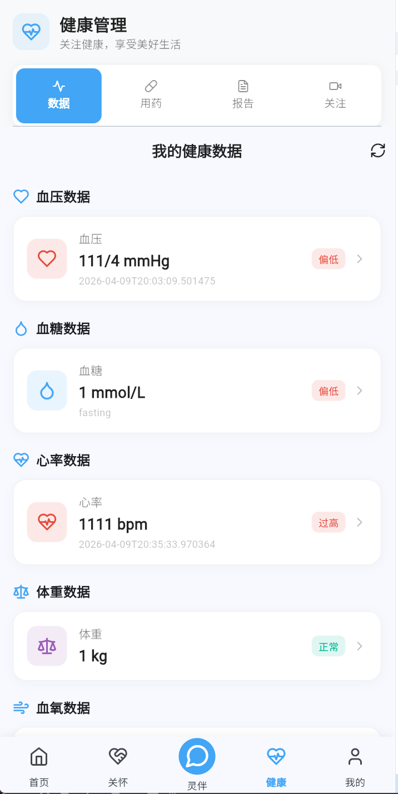
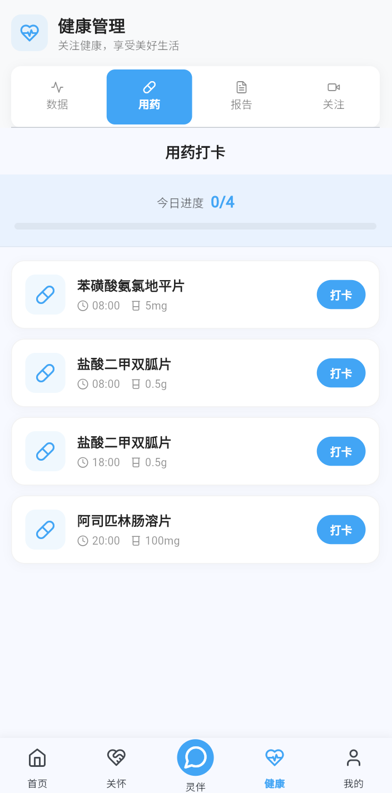
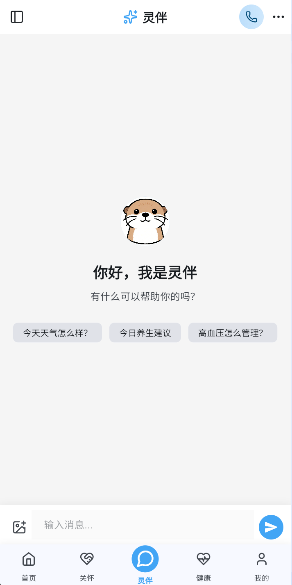
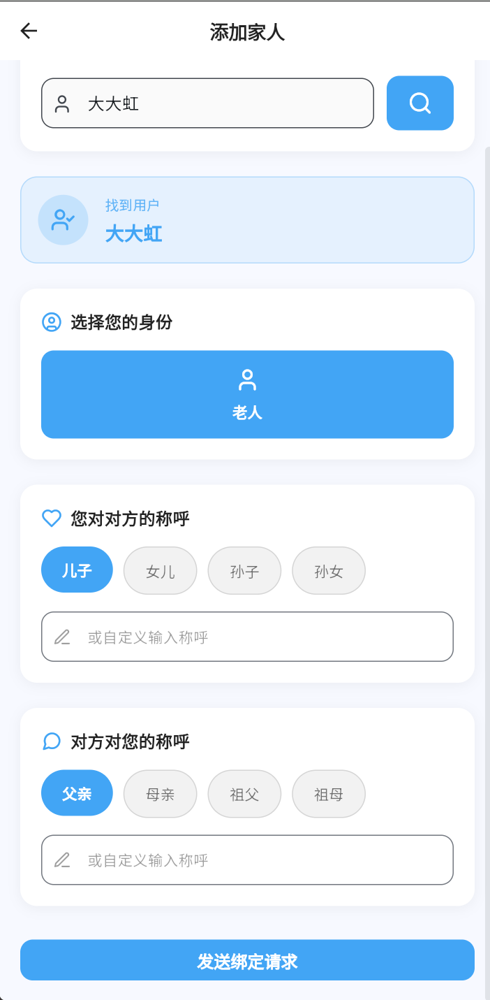

# 灵伴AI - 老年健康管理平台

<div align="center">


**守护你的心灵，温暖每一个家庭**

[](https://flutter.dev/)
[](https://spring.io/)
[](https://vuejs.org/)
[](https://www.postgresql.org/)

[在线演示](#) | [快速开始](#快速开始) | [功能特性](#功能特性) | [技术架构](#技术架构)

</div>

---

## 📖 项目介绍

这是一个为老年人设计的健康管理平台，包含手机App、Web管理后台和后端服务三部分。

### 为什么做这个项目？

随着父母年龄增长，健康管理变得越来越重要。但现有的健康管理应用要么功能复杂，要么字体太小，对老年人很不友好。所以我们做了这个项目：

- **界面简单**：大字体、高对比度，老年人看得清
- **操作方便**：减少复杂流程，一键完成操作
- **家人互联**：子女可以远程查看父母的健康数据
- **AI辅助**：集成AI对话，提供健康咨询服务

### 主要功能

**手机App（老年人使用）**
- 登录注册：支持手机号、邮箱验证码登录
- 健康记录：记录血压、血糖、心率等数据
- 用药提醒：定时提醒吃药，记录用药情况
- 地图定位：家园定位、查找周边医院
- 健康视频：观看健康知识视频
- AI对话：智能健康咨询
- 家庭绑定：子女可以查看老人的健康数据

**Web管理后台（管理员使用）**
- 用户管理：查看和管理用户信息
- 内容管理：发布健康视频和推文
- 数据统计：查看平台使用情况

**后端服务**
- 提供API接口
- 集成AI服务（OpenAI、DeepSeek、通义千问）
- 邮件发送服务
- WebSocket实时通信

### 📸 应用截图

<div align="center">

#### 移动端界面

| 启动页 | 登录页 | 首页 |
|:---:|:---:|:---:|
|  |  |  |

| 健康监测 | 用药管理 | AI对话 |
|:---:|:---:|:---:|
|  |  |  |

| 家园定位 | 家庭绑定 | 个人中心 |
|:---:|:---:|:---:|
|  |  |  |

#### Web管理端界面

| 登录页 | 数据看板 | 用户管理 |
|:---:|:---:|:---:|
|  |  |  |

</div>

---

## 🏗️ 技术架构

### 整体架构

```
┌─────────────────────────────────────────────────────────┐
│                      客户端层                            │
├──────────────────┬──────────────────┬──────────────────┤
│   Flutter App    │    Vue.js Web    │   第三方服务      │
│  (Android/iOS)   │   (管理后台)      │  (百度地图等)     │
└──────────────────┴──────────────────┴──────────────────┘
                          ↓ HTTPS/WebSocket
┌─────────────────────────────────────────────────────────┐
│                    应用服务层                            │
├──────────────────┬──────────────────┬──────────────────┤
│  Spring Boot API │   AI服务集群      │   实时通信服务    │
│  (业务逻辑)       │  (智能对话)       │   (WebSocket)    │
└──────────────────┴──────────────────┴──────────────────┘
                          ↓
┌─────────────────────────────────────────────────────────┐
│                    数据存储层                            │
├──────────────────┬──────────────────┬──────────────────┤
│   PostgreSQL     │      Redis       │   RabbitMQ       │
│   (主数据库)      │    (缓存)        │   (消息队列)      │
└──────────────────┴──────────────────┴──────────────────┘
```

### 技术栈

#### 移动端
- **框架**：Flutter 3.x
- **语言**：Dart 3.x
- **状态管理**：Provider
- **路由**：go_router
- **网络请求**：Dio + HTTP
- **本地存储**：SharedPreferences
- **地图服务**：百度地图SDK
- **UI组件**：Material Design + Lucide Icons

#### Web管理端
- **框架**：Vue.js 3.x
- **构建工具**：Vite
- **UI框架**：Tailwind CSS
- **状态管理**：Pinia
- **路由**：Vue Router
- **HTTP客户端**：Axios

#### 后端服务
- **框架**：Spring Boot 3.x
- **语言**：Java 17
- **数据库**：PostgreSQL 15+
- **缓存**：Redis
- **消息队列**：RabbitMQ
- **认证**：JWT + Spring Security
- **API文档**：Swagger/Knife4j
- **AI集成**：OpenAI、DeepSeek、通义千问

#### DevOps
- **容器化**：Docker
- **CI/CD**：GitHub Actions（可选）
- **日志**：SLF4J + Logback
- **监控**：Spring Boot Actuator

---

## 📁 项目结构

```
lingbanAI-betterChoose/
├── code/                          # 源代码目录
│   ├── common-base-server/        # 后端服务
│   │   ├── cb-common/             # 公共模块
│   │   ├── cb-pojo/               # 实体类模块
│   │   ├── cb-service/            # 业务服务模块
│   │   └── pom.xml                # Maven父项目配置
│   │
│   ├── common_base_mobile_flutter/ # 移动端应用
│   │   ├── lib/                   # Dart源代码
│   │   │   ├── config/            # 配置文件
│   │   │   ├── models/            # 数据模型
│   │   │   ├── providers/         # 状态管理
│   │   │   ├── routes/            # 路由配置
│   │   │   ├── screens/           # 页面组件
│   │   │   ├── services/          # 服务层
│   │   │   └── main.dart          # 应用入口
│   │   ├── android/               # Android平台代码
│   │   ├── ios/                   # iOS平台代码
│   │   └── pubspec.yaml           # Flutter依赖配置
│   │
│   └── common-base-web-vue/       # Web管理端
│       ├── src/                   # Vue源代码
│       │   ├── components/        # 组件
│       │   ├── views/             # 页面
│       │   ├── router/            # 路由
│       │   ├── stores/            # 状态管理
│       │   └── utils/             # 工具函数
│       └── package.json           # npm依赖配置
│
├── deploy/                        # 部署相关
│   └── server/                    # 服务器部署脚本
│
├── sql/                           # 数据库脚本
│
├── .gitignore                     # Git忽略配置
└── README.md                      # 项目说明文档
```

---

## 🚀 快速开始

### 环境要求

#### 移动端开发
- Flutter SDK 3.0+
- Dart SDK 3.0+
- Android Studio / VS Code
- Xcode（iOS开发）

#### 后端开发
- JDK 17+
- Maven 3.6+
- PostgreSQL 15+
- Redis 6.0+
- RabbitMQ 3.8+

#### Web前端开发
- Node.js 16+
- npm 8+ 或 yarn 1.22+

### 安装与运行

#### 1. 克隆项目

```bash
git clone <项目地址>
cd lingbanAI-betterChoose
```

#### 2. 配置敏感信息

**重要：项目使用配置文件管理敏感信息，请先配置以下文件：**

##### 移动端配置
```bash
cd code/common_base_mobile_flutter/lib/config
cp api_keys_example.dart api_keys.dart
# 编辑 api_keys.dart，填入实际的百度地图 API Key
```

```bash
cd code/common_base_mobile_flutter/android
cp local.properties.example local.properties
# 编辑 local.properties，填入实际的百度地图 API Key
```

##### 后端配置
```bash
cd code/common-base-server/cb-service/src/main/resources
# 创建 application-prod.yml（生产环境配置）
# 创建 application-dev.yml（开发环境配置）
# 配置数据库、Redis、RabbitMQ、邮箱等连接信息
```

#### 3. 启动后端服务

```bash
cd code/common-base-server

# 编译项目
mvn clean install

# 运行服务
cd cb-service
mvn spring-boot:run
```

后端服务将在 `http://localhost:15555` 启动

#### 4. 启动移动端应用

```bash
cd code/common_base_mobile_flutter

# 安装依赖
flutter pub get

# 运行应用（选择设备）
flutter run

# 或指定设备运行
flutter run -d chrome      # Web浏览器
flutter run -d emulator    # Android模拟器
flutter run -d simulator   # iOS模拟器
```

#### 5. 启动Web管理端

```bash
cd code/common-base-web-vue

# 安装依赖
npm install

# 运行开发服务器
npm run dev

# 构建生产版本
npm run build
```

Web管理端将在 `http://localhost:5173` 启动

---

## ⚙️ 配置说明

### 移动端配置

#### API Keys 配置
编辑 `lib/config/api_keys.dart`：
```dart
class ApiKeys {
  static const String baiduMapAndroidKey = 'YOUR_ANDROID_API_KEY';
  static const String baiduMapIosKey = 'YOUR_IOS_API_KEY';
}
```

#### Android 配置
编辑 `android/local.properties`：
```properties
baidu.map.api.key=YOUR_BAIDU_MAP_API_KEY
```

### 后端配置

#### 数据库配置
```yaml
spring:
  datasource:
    url: jdbc:postgresql://localhost:5432/lingban_ai
    username: your_username
    password: your_password
```

#### Redis配置
```yaml
spring:
  data:
    redis:
      host: localhost
      port: 6379
      password: your_password
```

#### AI服务配置
```yaml
hcprop:
  ai:
    openai:
      api-key: ${OPENAI_API_KEY}
    deepseek:
      api-key: ${DEEPSEEK_API_KEY}
    dashscope:
      api-key: ${DASHSCOPE_API_KEY}
```

---

## 🔒 安全说明

### 敏感信息管理

项目已配置 `.gitignore` 忽略以下敏感文件：

- ✅ `**/api_keys.dart` - 移动端API密钥
- ✅ `**/local.properties` - Android本地配置
- ✅ `**/application-*.yml` - 环境配置文件
- ✅ `**/*.sql` - 数据库脚本
- ✅ `**/*.keystore` - 签名密钥
- ✅ `**/*.jks` - Java密钥库
- ✅ `**/.env` - 环境变量文件

### 安全最佳实践

1. **不要提交敏感信息**到Git仓库
2. **使用环境变量**管理生产环境配置
3. **定期更换密钥**和密码
4. **启用HTTPS**加密传输
5. **实施访问控制**和权限管理

---

## 📱 功能特性

### 健康管理

- **📊 健康数据记录**：血压、血糖、心率、血氧等
- **📈 健康趋势分析**：数据可视化、趋势图表
- **💊 用药提醒**：定时提醒、打卡记录
- **🏥 健康报告**：周期性健康报告生成

### 智能服务

- **🤖 AI健康咨询**：智能对话、健康建议
- **🎤 语音交互**：语音输入、语音播报
- **📍 位置服务**：家园定位、周边医院查询
- **📹 健康教育**：视频学习、推文阅读

### 家庭关怀

- **👨‍👩‍👧‍👦 家庭绑定**：子女绑定老人账号
- **📱 远程监护**：查看老人健康数据
- **🔔 异常提醒**：健康异常自动通知
- **💬 即时通讯**：家庭成员沟通

---

## 🛠️ 开发指南

### 代码规范

- **Flutter**：遵循 [Effective Dart](https://dart.dev/guides/language/effective-dart) 规范
- **Java**：遵循 [Google Java Style Guide](https://google.github.io/styleguide/javaguide.html)
- **Vue.js**：遵循 [Vue Style Guide](https://vuejs.org/style-guide/)

### 分支管理

- `main` - 主分支，生产环境代码
- `develop` - 开发分支，日常开发
- `feature/*` - 功能分支，新功能开发
- `hotfix/*` - 修复分支，紧急修复

### 提交规范

使用 [Conventional Commits](https://www.conventionalcommits.org/) 规范：

- `feat:` 新功能
- `fix:` 修复bug
- `docs:` 文档更新
- `style:` 代码格式调整
- `refactor:` 代码重构
- `test:` 测试相关
- `chore:` 构建/工具链相关

---

## 📦 部署说明

### Docker部署

#### 后端服务
```bash
cd deploy/server
./deploy.sh
```

#### 移动端打包
```bash
cd code/common_base_mobile_flutter

# Android APK
flutter build apk --release

# Android App Bundle
flutter build appbundle --release

# iOS
flutter build ios --release
```

### 生产环境配置

1. **数据库优化**：配置连接池、索引优化
2. **缓存策略**：Redis缓存热点数据
3. **负载均衡**：Nginx反向代理
4. **日志管理**：集中式日志收集
5. **监控告警**：系统监控、异常告警

---

## 🤝 贡献指南

我们欢迎所有形式的贡献！

### 如何贡献

1. Fork 本仓库
2. 创建功能分支 (`git checkout -b feature/AmazingFeature`)
3. 提交更改 (`git commit -m 'feat: Add some AmazingFeature'`)
4. 推送到分支 (`git push origin feature/AmazingFeature`)
5. 创建 Pull Request

### 贡献类型

- 🐛 Bug修复
- ✨ 新功能开发
- 📝 文档改进
- 🎨 UI/UX优化
- 🔧 性能优化
- 🌐 国际化翻译

---

## 📄 许可证

本项目采用 MIT 许可证 - 详见 [LICENSE](LICENSE) 文件

---

## 👥 开发团队

**灵伴AI技术团队** - 专注于为老年人提供智能健康管理解决方案

- 项目负责人：[@hongchu](https://github.com/hongchu)
- 技术支持：support@hongchu.com

---

## 🙏 致谢

感谢以下开源项目：

- [Flutter](https://flutter.dev/)
- [Spring Boot](https://spring.io/)
- [Vue.js](https://vuejs.org/)
- [PostgreSQL](https://www.postgresql.org/)
- [百度地图开放平台](https://lbsyun.baidu.com/)

---

<div align="center">

**灵伴AI - 守护你的心灵** 💝

让科技温暖每一个家庭

[⬆ 返回顶部](#灵伴ai---老年健康管理平台)

</div>
